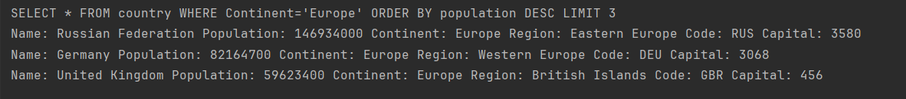
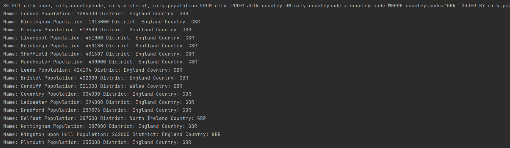

Group 11's Semester Project

# Software Engineering Methods
Develop Branch: 

| Name                   | Matriculation No. | Review 1 | Review 2 | Review 3 |
|------------------------|-------------------|---|----------|----------|
| Patric Mountcastle     | 40689401          | 34% | 33.4%    | 50%     |
| Fergus Reid            | 40534638          | 33% | 33.3%    | 50%      |
| Joao Tome              | 40658588          | 33% | 33.3%    | 0%       |
 | Maja Kolodziej        | ---------         | N/A | N/A      | 0%       |

| Rule Number | Code of Conduct|
|-------------|---|
| 1           | Meet every week for half an hour and discuss tasks for the week|
| 2           | Communicate using Discord|
| 3           | Inform other group mates of meeting cancellations at least one hour in advance|
| 4           | Always create a new feature branch off of develop and never use master directly|
| 5           | Inform team of feature you are working on|
| 6           | If working on similar features, coordinate with other member to ensure no work gets lost in translation|
| 7           | Be kind and respectful to one another|
| 8           | Bring up issues you have at the team meetings to ensure constructive feedbackS|

# Requirements Met Section

| ID | Name                                                                                                 | Met | Screenshot                | 
|----|------------------------------------------------------------------------------------------------------|-----|---------------------------|
| 1  | All the countries in the world organised by largest population to smallest                           | Yes |        |
| 2  | All the countries in a continent organised by largest population to smallest                         | Yes |    | 
| 3  | All the countries in a region organised by largest population to smallest                            | Yes |    |
| 4  | The top N populated countries in the world where N is provided by the user.                          | Yes |    |
| 5  | The top N populated countries in a continent where N is provided by the user.                        | Yes |    |
| 6  | The top N populated countries in a region where N is provided by the user.                           | Yes |    | 
| 7  | All the cities in the world organised by largest population to smallest                              | Yes |    |
| 8  | All the cities in a continent organised by largest population to smallest                            | Yes |  |
| 9  | All the cities in a region organised by largest population to smallest                               | Yes |    |
| 10 | All the cities in a country organised by largest population to smallest                              | Yes |    | 
| 11 | All the cities in a district organised by largest population to smallest                             | Yes |  |
| 12 | The top N populated cities in the world where N is provided by the user.                             | Yes |    |
| 13 | The top N populated cities in a continent where N is provided by the user.                           | Yes |  |
| 14 | The top N populated cities in a region where N is provided by the user.                              | Yes |  | 
| 15 | The top N populated cities in a country where N is provided by the user.                             | Yes |  |
| 16 | The top N populated cities in a district where N is provided by the user.                            | Yes |  |
| 17 | All the capital cities in the world organised by largest population to smallest                      | Yes |  |
| 18 | All the captial cities in a continent organised by largest population to smallest                    | Yes |  | 
| 19 | All the capital cities in a region organised by largest population to smallest                       | Yes |  |
| 20 | The top N populated capital cities in the world where N is provided by the user.                     | Yes |  |
| 21 | The top N populated capital cities in a continent where N is provided by the user.                   | Yes |  |
| 22 | The top N populated capital cities in a region where N is provided by the user.                      | Yes |  | 
| 23 | The population of people, people living in cities, and people not living in cities in each continent | Yes |  |
| 24 | The population of people, people living in cities, and people not living in cities in each region    | Yes |  |
| 25 | The population of people, people living in cities, and people not living in cities in each country   | Yes |  |
| 26 | The population of the world                                                                          | Yes |  | 
| 27 | The population of a continent                                                                        | Yes |  |
| 28 | The population of a region                                                                           | Yes |  |
| 29 | The population of a country                                                                          | Yes |  |
| 30 | The population of a district                                                                         | Yes |                           | 
| 31 | The population of a city                                                                             | Yes |  |
| 32 | Language report                                                                                      | Yes |  |
